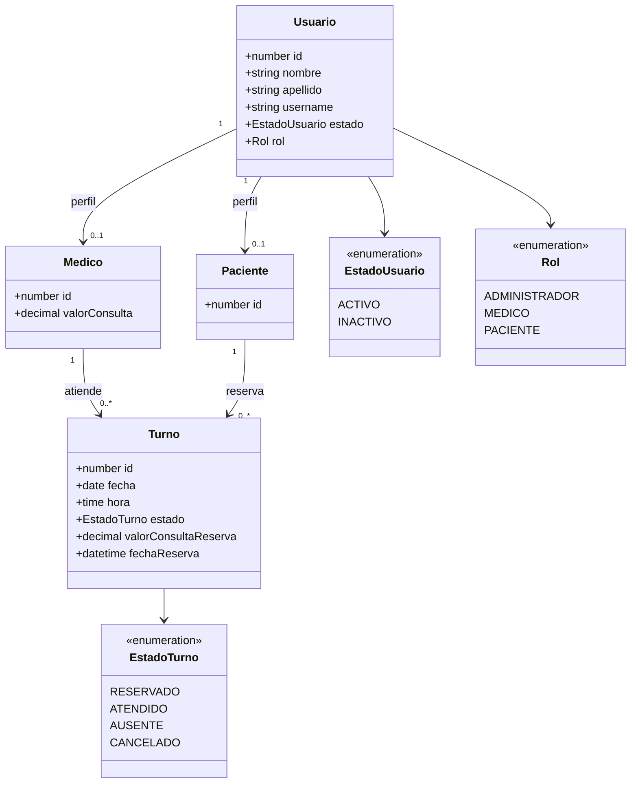
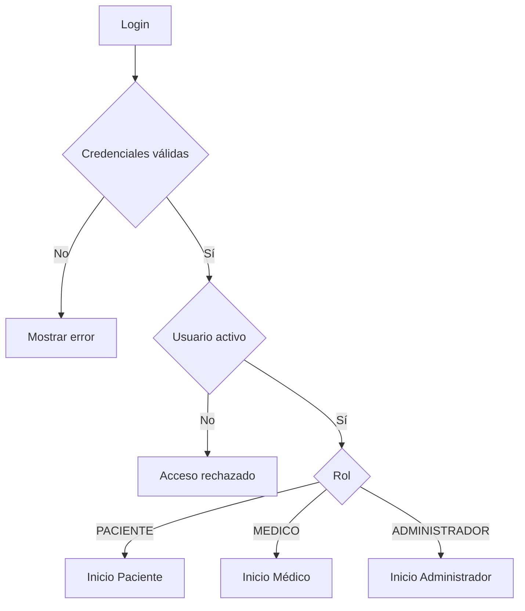
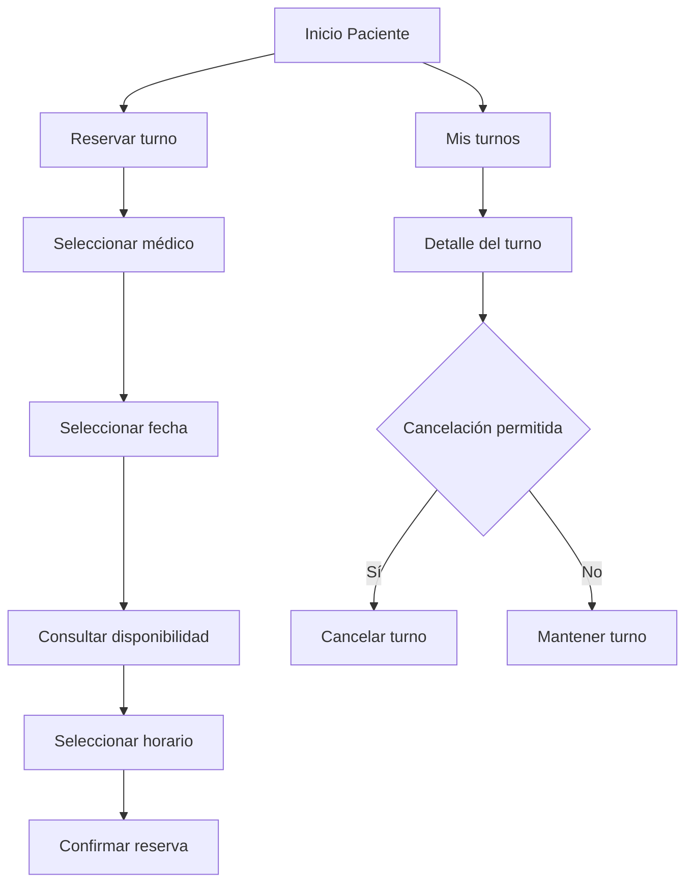
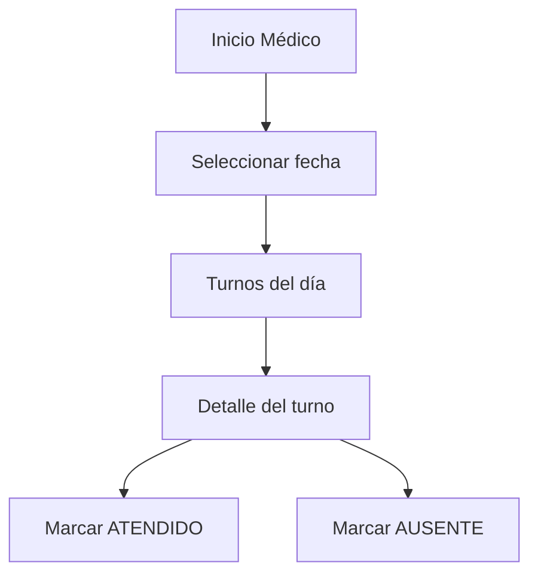
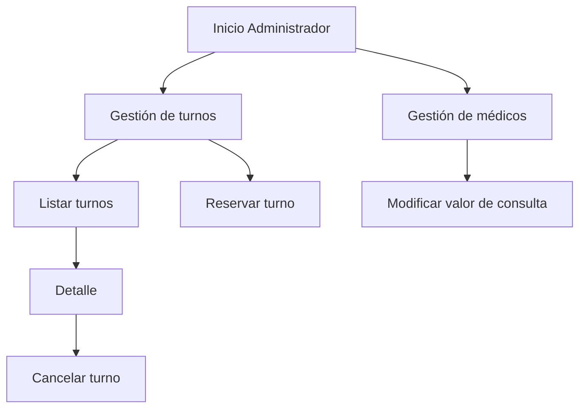
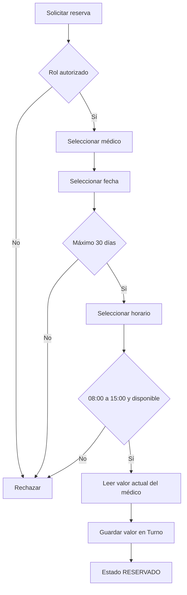
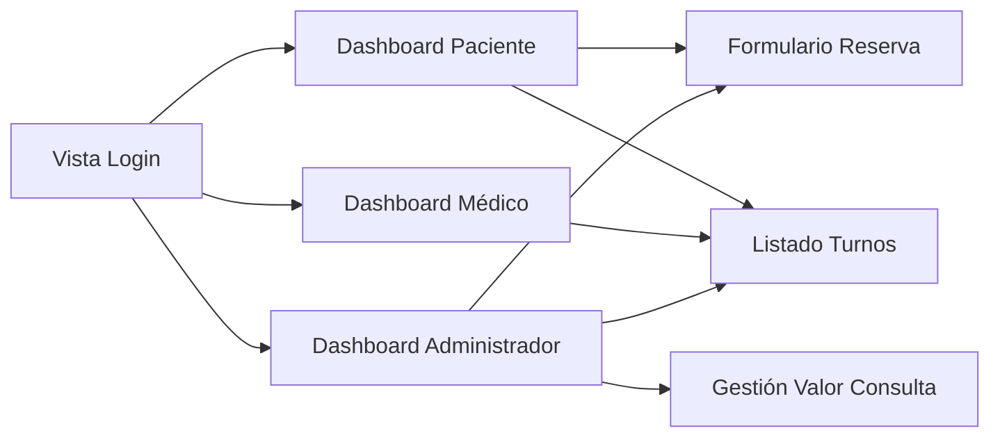

# Diagramas OOWS

## 1. Modelo Conceptual

## 2. Modelo Navegacional General

## 3. Contexto Navegacional del Paciente

## 4. Contexto Navegacional del Médico

## 5. Contexto Navegacional del Administrador

## 6. Flujo de Reserva

## 7. Modelo de Presentación

## 8. Reglas Asociadas

- Horario de atención: 08:00 a 16:00.
- Duración de cada turno: 1 hora.
- Horarios de inicio: 08:00 a 15:00.
- Anticipación máxima: 30 días.
- El valor de la consulta queda fijado al realizar la reserva.
- El paciente puede cancelar hasta el día anterior.
- El administrador puede cancelar antes del inicio de la consulta.
- El médico puede marcar un turno como ATENDIDO o AUSENTE.
